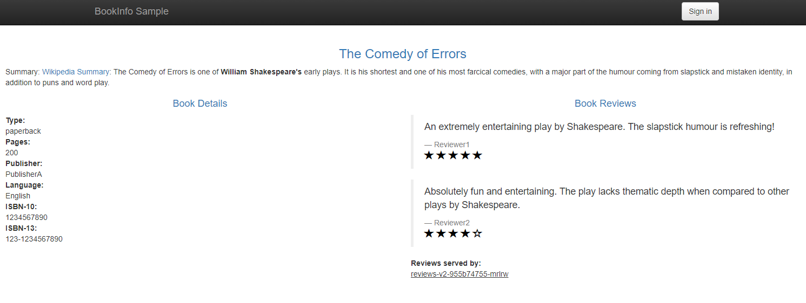
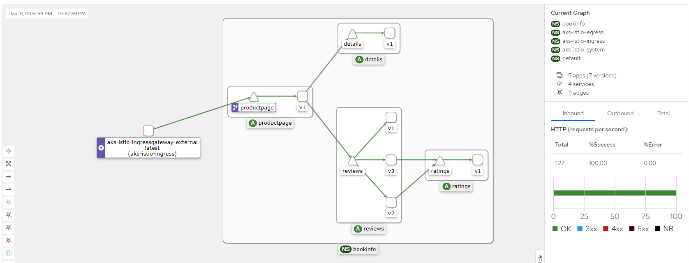

# akstrain
aks and istio

## 워크샵 주제
* Multi-container pods
    * 1st section..

## Hands-on Lab 
### 사전 필요 환경
<details>
  <summary> Ubuntu 기준 환경 설정 방법</summary>
  
  ```bash
  # Azure CLI 설치
  curl -sL https://aka.ms/InstallAzureCLIDeb | sudo bash

  # AKS CLI 설치
  sudo az aks install-cli

  # Helm 설치
  curl https://raw.githubusercontent.com/helm/helm/main/scripts/get-helm-3 | bash

  # vscode 설치(WSL 이나 로컬 환경인 경우)
  sudo apt-get install wget gpgwget -qO- https://packages.microsoft.com/keys/microsoft.asc | gpg --dearmor > packages.microsoft.gpgsudo install -D -o root -g root -m 644 packages.microsoft.gpg /etc/apt/keyrings/packages.microsoft.gpgsudo sh -c 'echo "deb [arch=amd64,arm64,armhf signed-by=/etc/apt/keyrings/packages.microsoft.gpg] https://packages.microsoft.com/repos/code stable main" > /etc/apt/sources.list.d/vscode.list'rm -f packages.microsoft.gpg

  sudo apt install apt-transport-https
  sudo apt update
  sudo apt install code

  # SSH Server 설치(윈도우 사용자가 vscode remote 를 이용해서 작업하기위한 환경)
  sudo apt-get install openssh-server
  sudo apt-get install sshfs

  ```
  window cmd 에서
  ```cmd
  ssh-keygen -t rsa -b 4096 -f %userprofile%\.ssh\linux_rsa
  scp %userprofile%\.ssh\linux_rsa.pub -i <pem_file_path> dotnetpower@<remote_ip>:~/
  ```
  ubuntu 에서
  ```bash
  sudo cat linux_rsa.pub >> ~/.ssh/authorized_keys
  sudo nano /etc/ssh/sshd_config
  # sshd_config 파일 중 AllowTcpForwarding yes 주석 해제
  sudo systemctl restart sshd
  ```

  접속 테스트를 위해 window cmd 에서
  ```cmd
  ssh -i %userprofile%/.ssh/linux_rsa user_id@<remote_ip>
  ```

  vscode 의 remote explorer extension 설치 하여 리모트 서버 접속

  **!주의: Azure VM 의 경우 SSH port open 시간이 짧아서 JIT open 을 주기적으로 해야 함.**

</details>

### 클러스터 구성

istio-env.sh
```
# 환경변수
seq=6
export CLUSTER=istio-addon-lab-${seq}
export RESOURCE_GROUP=istio-addon-lab-rg-${seq}
export LOCATION=eastus #koreacentral
export K8S_VERSION=1.27.7

```


```
# 환경변수 설정
source ./istio-env.sh
```

aks-preview 설정 및 AzureServiceMeshPreview 활성화 (mesh 타입을 osm 이나 istio 로 지정 필요)
```bash
# aks-preview 설치
az extension add --name aks-preview
az extension update --name aks-preview

# AzureServiceMeshPreview 등록
az feature register --namespace "Microsoft.ContainerService" --name "AzureServiceMeshPreview"
az feature show --namespace "Microsoft.ContainerService" --name "AzureServiceMeshPreview"

# 컨테이너 서비스 등록(권한 오류가 발생하는 경우 권한 있는 사용자가 실행 필요)
az provider register --namespace Microsoft.ContainerService


# 리소스 그룹 생성[5secs]
az group create --location $LOCATION --resource-group $RESOURCE_GROUP

# 클러스터 생성[6mins]
az aks create \
--resource-group $RESOURCE_GROUP \
--name $CLUSTER \
--enable-asm \
--network-plugin azure \
--node-count 3 \
--kubernetes-version $K8S_VERSION \
--generate-ssh-keys

# (optional)이미 생성된 클러스터가 있는 경우 mesh 활성화를 위해 다음 명령
# az aks mesh enable -g $RESOURCE_GROUP -n $CLUSTER 

az aks get-credentials --resource-group $RESOURCE_GROUP --name $CLUSTER


```

정상 설정 여부 확인
```bash
# 다음 명령어 실행 후 "Istio" 가 정상적으로 나오는지 확인
az aks show --resource-group $RESOURCE_GROUP --name $CLUSTER  --query 'serviceMeshProfile.mode'

# aks-istio-system 네임스페이스에 대한 파드 확인
kubectl get pods -n aks-istio-system


```

sidecar 주입 활성화(bookinfo)
```bash
kubectl create ns bookinfo
kubectl label namespace bookinfo istio.io/rev=asm-1-17


```

istioctl 설치
```bash
# 버전 확인
ISTIO_VERSION="$(kubectl get deploy istiod-asm-1-17 -n aks-istio-system -o yaml | grep image: | egrep -o '[0-9]+\.[0-9]+\.[0-9]+')"

# 설정된 버전 확인
echo $ISTIO_VERSION

# cli 설치
curl -L https://istio.io/downloadIstio | ISTIO_VERSION=$ISTIO_VERSION TARGET_ARCH=x86_64 sh -
sudo cp  "istio-${ISTIO_VERSION}/bin/istioctl" /usr/local/bin
rm -rf "./istio-${ISTIO_VERSION}/"

# istio 버전 확인
istioctl -i aks-istio-system version

```
> client version: 1.17.8 \
control plane version: 1.17-dev \
data plane version: none

**data plane 이 none 으로 보여지는 이유는 배포된 in/egress traffic, envoy proxy 가 없기 때문**


외부 ingress 게이트웨이 활성화[4분가량 소요]
```bash
az aks mesh enable-ingress-gateway --resource-group $RESOURCE_GROUP --name $CLUSTER --ingress-gateway-type external

# public ip, port 확인
kubectl get svc aks-istio-ingressgateway-external -n aks-istio-ingress

# istiod 버전 확인
kubectl get deploy -n aks-istio-system

# istiod dash 설치/실행(버전이 1.17인 경우)
istioctl dashboard controlz deployment/istiod-asm-1-17 -n aks-istio-system
```


Bookinfo 샘플 앱 배포
```bash
kubectl apply -f https://raw.githubusercontent.com/istio/istio/release-1.17/samples/bookinfo/platform/kube/bookinfo.yaml -n bookinfo

```
<details>
  <summary>bookinfo.yaml</summary>

```
# Copyright Istio Authors
#
#   Licensed under the Apache License, Version 2.0 (the "License");
#   you may not use this file except in compliance with the License.
#   You may obtain a copy of the License at
#
#       http://www.apache.org/licenses/LICENSE-2.0
#
#   Unless required by applicable law or agreed to in writing, software
#   distributed under the License is distributed on an "AS IS" BASIS,
#   WITHOUT WARRANTIES OR CONDITIONS OF ANY KIND, either express or implied.
#   See the License for the specific language governing permissions and
#   limitations under the License.

##################################################################################################
# This file defines the services, service accounts, and deployments for the Bookinfo sample.
#
# To apply all 4 Bookinfo services, their corresponding service accounts, and deployments:
#
#   kubectl apply -f samples/bookinfo/platform/kube/bookinfo.yaml
#
# Alternatively, you can deploy any resource separately:
#
#   kubectl apply -f samples/bookinfo/platform/kube/bookinfo.yaml -l service=reviews # reviews Service
#   kubectl apply -f samples/bookinfo/platform/kube/bookinfo.yaml -l account=reviews # reviews ServiceAccount
#   kubectl apply -f samples/bookinfo/platform/kube/bookinfo.yaml -l app=reviews,version=v3 # reviews-v3 Deployment
##################################################################################################

##################################################################################################
# Details service
##################################################################################################
apiVersion: v1
kind: Service
metadata:
  name: details
  labels:
    app: details
    service: details
spec:
  ports:
  - port: 9080
    name: http
  selector:
    app: details
---
apiVersion: v1
kind: ServiceAccount
metadata:
  name: bookinfo-details
  labels:
    account: details
---
apiVersion: apps/v1
kind: Deployment
metadata:
  name: details-v1
  labels:
    app: details
    version: v1
spec:
  replicas: 1
  selector:
    matchLabels:
      app: details
      version: v1
  template:
    metadata:
      labels:
        app: details
        version: v1
    spec:
      serviceAccountName: bookinfo-details
      containers:
      - name: details
        image: docker.io/istio/examples-bookinfo-details-v1:1.17.0
        imagePullPolicy: IfNotPresent
        ports:
        - containerPort: 9080
        securityContext:
          runAsUser: 1000
---
##################################################################################################
# Ratings service
##################################################################################################
apiVersion: v1
kind: Service
metadata:
  name: ratings
  labels:
    app: ratings
    service: ratings
spec:
  ports:
  - port: 9080
    name: http
  selector:
    app: ratings
---
apiVersion: v1
kind: ServiceAccount
metadata:
  name: bookinfo-ratings
  labels:
    account: ratings
---
apiVersion: apps/v1
kind: Deployment
metadata:
  name: ratings-v1
  labels:
    app: ratings
    version: v1
spec:
  replicas: 1
  selector:
    matchLabels:
      app: ratings
      version: v1
  template:
    metadata:
      labels:
        app: ratings
        version: v1
    spec:
      serviceAccountName: bookinfo-ratings
      containers:
      - name: ratings
        image: docker.io/istio/examples-bookinfo-ratings-v1:1.17.0
        imagePullPolicy: IfNotPresent
        ports:
        - containerPort: 9080
        securityContext:
          runAsUser: 1000
---
##################################################################################################
# Reviews service
##################################################################################################
apiVersion: v1
kind: Service
metadata:
  name: reviews
  labels:
    app: reviews
    service: reviews
spec:
  ports:
  - port: 9080
    name: http
  selector:
    app: reviews
---
apiVersion: v1
kind: ServiceAccount
metadata:
  name: bookinfo-reviews
  labels:
    account: reviews
---
apiVersion: apps/v1
kind: Deployment
metadata:
  name: reviews-v1
  labels:
    app: reviews
    version: v1
spec:
  replicas: 1
  selector:
    matchLabels:
      app: reviews
      version: v1
  template:
    metadata:
      labels:
        app: reviews
        version: v1
    spec:
      serviceAccountName: bookinfo-reviews
      containers:
      - name: reviews
        image: docker.io/istio/examples-bookinfo-reviews-v1:1.17.0
        imagePullPolicy: IfNotPresent
        env:
        - name: LOG_DIR
          value: "/tmp/logs"
        ports:
        - containerPort: 9080
        volumeMounts:
        - name: tmp
          mountPath: /tmp
        - name: wlp-output
          mountPath: /opt/ibm/wlp/output
        securityContext:
          runAsUser: 1000
      volumes:
      - name: wlp-output
        emptyDir: {}
      - name: tmp
        emptyDir: {}
---
apiVersion: apps/v1
kind: Deployment
metadata:
  name: reviews-v2
  labels:
    app: reviews
    version: v2
spec:
  replicas: 1
  selector:
    matchLabels:
      app: reviews
      version: v2
  template:
    metadata:
      labels:
        app: reviews
        version: v2
    spec:
      serviceAccountName: bookinfo-reviews
      containers:
      - name: reviews
        image: docker.io/istio/examples-bookinfo-reviews-v2:1.17.0
        imagePullPolicy: IfNotPresent
        env:
        - name: LOG_DIR
          value: "/tmp/logs"
        ports:
        - containerPort: 9080
        volumeMounts:
        - name: tmp
          mountPath: /tmp
        - name: wlp-output
          mountPath: /opt/ibm/wlp/output
        securityContext:
          runAsUser: 1000
      volumes:
      - name: wlp-output
        emptyDir: {}
      - name: tmp
        emptyDir: {}
---
apiVersion: apps/v1
kind: Deployment
metadata:
  name: reviews-v3
  labels:
    app: reviews
    version: v3
spec:
  replicas: 1
  selector:
    matchLabels:
      app: reviews
      version: v3
  template:
    metadata:
      labels:
        app: reviews
        version: v3
    spec:
      serviceAccountName: bookinfo-reviews
      containers:
      - name: reviews
        image: docker.io/istio/examples-bookinfo-reviews-v3:1.17.0
        imagePullPolicy: IfNotPresent
        env:
        - name: LOG_DIR
          value: "/tmp/logs"
        ports:
        - containerPort: 9080
        volumeMounts:
        - name: tmp
          mountPath: /tmp
        - name: wlp-output
          mountPath: /opt/ibm/wlp/output
        securityContext:
          runAsUser: 1000
      volumes:
      - name: wlp-output
        emptyDir: {}
      - name: tmp
        emptyDir: {}
---
##################################################################################################
# Productpage services
##################################################################################################
apiVersion: v1
kind: Service
metadata:
  name: productpage
  labels:
    app: productpage
    service: productpage
spec:
  ports:
  - port: 9080
    name: http
  selector:
    app: productpage
---
apiVersion: v1
kind: ServiceAccount
metadata:
  name: bookinfo-productpage
  labels:
    account: productpage
---
apiVersion: apps/v1
kind: Deployment
metadata:
  name: productpage-v1
  labels:
    app: productpage
    version: v1
spec:
  replicas: 1
  selector:
    matchLabels:
      app: productpage
      version: v1
  template:
    metadata:
      labels:
        app: productpage
        version: v1
    spec:
      serviceAccountName: bookinfo-productpage
      containers:
      - name: productpage
        image: docker.io/istio/examples-bookinfo-productpage-v1:1.17.0
        imagePullPolicy: IfNotPresent
        ports:
        - containerPort: 9080
        volumeMounts:
        - name: tmp
          mountPath: /tmp
        securityContext:
          runAsUser: 1000
      volumes:
      - name: tmp
        emptyDir: {}
---
```
</details>

서비스 생성 확인
```bash
kubectl get services -n bookinfo

```

파드 확인
```bash
kubectl get pods -n bookinfo
```

DestinationRule 설정
```bash
kubectl apply -f https://raw.githubusercontent.com/istio/istio/release-1.17/samples/bookinfo/networking/destination-rule-all.yaml -n bookinfo

# destinationrule 확인
kubectl get destinationrules -n bookinfo

# kubectl get destinationrule details -n bookinfo -o yaml
```

<details>
  <summary>destination-rule-all.yaml</summary>

```
apiVersion: networking.istio.io/v1alpha3
kind: DestinationRule
metadata:
  name: productpage
spec:
  host: productpage
  subsets:
  - name: v1
    labels:
      version: v1
---
apiVersion: networking.istio.io/v1alpha3
kind: DestinationRule
metadata:
  name: reviews
spec:
  host: reviews
  subsets:
  - name: v1
    labels:
      version: v1
  - name: v2
    labels:
      version: v2
  - name: v3
    labels:
      version: v3
---
apiVersion: networking.istio.io/v1alpha3
kind: DestinationRule
metadata:
  name: ratings
spec:
  host: ratings
  subsets:
  - name: v1
    labels:
      version: v1
  - name: v2
    labels:
      version: v2
  - name: v2-mysql
    labels:
      version: v2-mysql
  - name: v2-mysql-vm
    labels:
      version: v2-mysql-vm
---
apiVersion: networking.istio.io/v1alpha3
kind: DestinationRule
metadata:
  name: details
spec:
  host: details
  subsets:
  - name: v1
    labels:
      version: v1
  - name: v2
    labels:
      version: v2
---
```
</details>

내부에서 ratings 로 접속 테스트
```bash
kubectl exec "$(kubectl get pod -l app=ratings -o jsonpath='{.items[0].metadata.name}' -n bookinfo)" -n bookinfo -c ratings -- curl -sS productpage:9080/productpage | grep -o "<title>.*</title>"

```
> `<title>Simple Bookstore App</title>`

아직 외부에서 접속이 안되므로 외부에서 접속 허용을 위한 external ingress gateway 적용
```bash
kubectl apply -n bookinfo -f - <<EOF
apiVersion: networking.istio.io/v1alpha3
kind: Gateway
metadata:
  name: bookinfo-gateway-external
spec:
  selector:
    istio: aks-istio-ingressgateway-external
  servers:
  - port:
      number: 80
      name: http
      protocol: HTTP
    hosts:
    - "*"
---
apiVersion: networking.istio.io/v1alpha3
kind: VirtualService
metadata:
  name: bookinfo-vs-external
spec:
  hosts:
  - "*"
  gateways:
  - bookinfo-gateway-external
  http:
  - match:
    - uri:
        exact: /productpage
    - uri:
        prefix: /static
    - uri:
        exact: /login
    - uri:
        exact: /logout
    - uri:
        prefix: /api/v1/products
    route:
    - destination:
        host: productpage
        port:
          number: 9080
EOF
```
생성 확인
```bash
kubectl get gateway -n bookinfo
kubectl get virtualservices -n bookinfo

```

외부 IP 를 가져오기 위해
```bash
export INGRESS_HOST_EXTERNAL=$(kubectl -n aks-istio-ingress get service aks-istio-ingressgateway-external -o jsonpath='{.status.loadBalancer.ingress[0].ip}')
export INGRESS_PORT_EXTERNAL=$(kubectl -n aks-istio-ingress get service aks-istio-ingressgateway-external -o jsonpath='{.spec.ports[?(@.name=="http2")].port}')
export GATEWAY_URL_EXTERNAL=$INGRESS_HOST_EXTERNAL:$INGRESS_PORT_EXTERNAL

# url 확인
echo "http://$GATEWAY_URL_EXTERNAL/productpage"
```

접속 테스트
```bash
curl -s "http://${GATEWAY_URL_EXTERNAL}/productpage" | grep -o "<title>.*</title>"

```
> `<title>Simple Bookstore App</title>`

확인된 URL 로 접속 시 - http://$GATEWAY_URL_EXTERNAL/productpage


## 모니터 도구

Prometheus, Grafana, Jaeger, Kiali 설치
```bash
# Prometheus - metrics
curl -s https://raw.githubusercontent.com/istio/istio/release-1.17/samples/addons/prometheus.yaml | sed 's/istio-system/aks-istio-system/g' | kubectl apply -f -

# Grafana - monitoring and metrics dashboards
curl -s https://raw.githubusercontent.com/istio/istio/release-1.17/samples/addons/grafana.yaml | sed 's/istio-system/aks-istio-system/g' | kubectl apply -f -

# Jaeger - distributed tracing
curl -s https://raw.githubusercontent.com/istio/istio/release-1.17/samples/addons/jaeger.yaml | sed 's/istio-system/aks-istio-system/g' | kubectl apply -f -

# Kiali installation
helm install \
    --version=1.63.1 \
    --set cr.create=true \
    --set cr.namespace=aks-istio-system \
    --namespace aks-istio-system \
    --create-namespace \
    kiali-operator \
    kiali/kiali-operator


```

Kiali 토큰 생성 및 포워포워딩(다른 콘솔에서, vscode 에서는 bash shell 추가하여 실행 필요)
```bash
# Kiali 에 접속하기 위한 토큰 생성
kubectl -n aks-istio-system create token kiali-service-account

# http://localhost:20001 으로 접속 할수 있도록 포트포워딩
kubectl port-forward svc/kiali 20001:20001 -n aks-istio-system
```

(optional) vscode remote 환경이라면 하단 Ports 탭에서 20001 포트 추가 후 http://localhost:20001 로 접속 가능


트래픽을 발생시켜 Kiali UI 에서 확인
```bash
for i in $(seq 1 100); do curl -o /dev/null -s -w "Request: ${i}, Response: %{http_code}\n" "http://$GATEWAY_URL_EXTERNAL/productpage"; done
```
Kiali 의 Graph 메뉴




## Prometheus 포트포워딩 및 접속 확인 (background 실행)
```bash
kubectl port-forward -n aks-istio-system svc/prometheus 9090:9090 &
```


몇가지 쿼리 - https://istio.io/latest/docs/tasks/observability/metrics/querying-metrics/
* productpage 서비스에 요청 수
  ```
  istio_requests_total{destination_service="productpage.bookinfo.svc.cluster.local"}
  ```
* reviews 서비스의 v3에 요청 수
  ```
  istio_requests_total{destination_service="reviews.bookinfo.svc.cluster.local", destination_version="v3"}
  ```
* 마지막 5분동안 productpage 의 모든 인스턴스에 대한 요청
  ```x
  rate(istio_requests_total{destination_service=~"productpage.*", response_code="200"}[5m])
  ```

## Grafana 포트포워딩 및 접속 확인 (background 실행)
```bash
kubectl port-forward -n aks-istio-system svc/grafana 3000:3000 &
```
Dashboard -> Browse -> istio


## Jaeger UI 포트포워딩 및 접속 확인 (background 실행)
```bash
kubectl port-forward -n aks-istio-system $JAEGER_POD 16686:16686 &
```


DAG(Directed Acyclic Graph) 확인
1. Search 메뉴
2. Service 에 productpage.bookinfo 선택
3. Lookback 에 적절한 시간 선택 후 Find Traces
4. 결과 하나를 클릭
5. System Architecture 메뉴
6. DAG 클릭


# istio 실습
## Request Routing
> [!Note]
> http://$GATEWAY_URL_EXTERNAL/productpage 에 접속하여 새로고침을 하여 reviews 의 버전이 바뀌는 것을 확인
> 1. v1 적용 후 새로고침 해서 v1 으로 고정이 되는지 확인
> 2. 사용자 계정은 jason/jason 이므로 로그인 후 v1 으로 유지 되는지 확인
> 3. v2 적용 후 새로고침, 로그아웃 후 예상과 같이 동작 하는지 확인
```bash
# 모든 요청을 reviews:v1 으로만 보내기
kubectl apply -f https://raw.githubusercontent.com/istio/istio/release-1.17/samples/bookinfo/networking/virtual-service-all-v1.yaml -n bookinfo

# jason 만 reviews:v2 로 보내기
kubectl apply -f https://raw.githubusercontent.com/istio/istio/release-1.17/samples/bookinfo/networking/virtual-service-reviews-test-v2.yaml -n bookinfo
```


---


vscode remote ports


```
# bash 커맨드 창에 시간 찍기
sudo timedatectl set-timezone Asia/Seoul
export PROMPT_COMMAND="echo -n \[\$(date +%H:%M:%S)\]\ "
```


